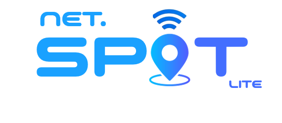

  

**Net Spot Lite** é uma aplicação web desenvolvida para agilizar o processo de consulta de viabilidade de internet fibra de diversas operadoras. O sistema é destinado exclusivamente ao uso interno por equipes de vendas de uma empresa credenciada para comercializar serviços de internet de diferentes operadoras.

## Objetivo

O objetivo do Net Spot Lite é unificar as consultas de cobertura, eliminando a necessidade de acessar o sistema de cada operadora separadamente. Isso reduz o tempo gasto em cada consulta e aumenta a eficiência do processo de vendas.

## Funcionalidades Lite

- **Consulta Unificada:** Permite a busca por cobertura de internet fibra em múltiplas operadoras simultaneamente, utilizando CEP e número da residência/comércio.
- **Integração com APIs:** Consome a API do [melhorplano.net](https://melhorplano.net/) para obter a viabilidade de cada operadora.
- **Interface Simples e Intuitiva:** Desenvolvida para ser usada no navegador, otimizando a experiência da equipe de vendas.

## Tecnologias Utilizadas

- **Frontend:**
  - HTML5
  - CSS3
  - JavaScript

- **APIs:**
  - Integração com a API do [melhorplano.net](https://melhorplano.net/) para consulta de cobertura.

## Arquitetura

- **Web-Based:** O aplicativo será acessado diretamente pelo navegador, sem necessidade de instalação.
- **Sem Banco de Dados:** Todas as consultas são realizadas diretamente na API, sem armazenamento local ou remoto.

## Como Funciona

1. O vendedor informa o CEP e o número do endereço desejado.
2. O vendedor pode escolher algumas operadoras que deseja consultar (ou desmarcar todas).
2. O Net Spot Lite realiza requisições a APIs do [melhorplano.net](https://melhorplano.net/) e retorna apenas a resposta das operadoras configuradas no projeto.
3. Os resultados das consultas são exibidos de forma consolidada, mostrando a disponibilidade de cada operadora no local solicitado.

## Melhorias Futuras

Periodicamente o projeto recebe atualizações e melhorias.

## Licença

Esse projeto está sob a licença MIT.

## Contato

Para dúvidas ou suporte, entre em contato com [GuiStelmach](https://github.com/GuiStelmach).
